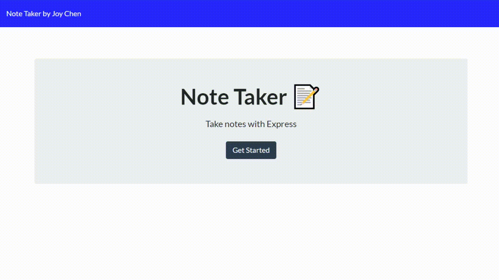

# Welcome to my Note Taking application

  
 
  
## Description
  
Everyone takes notes. Whether they scrible it down on a piece of paper, or quickly type on their phone, or even open a notepad document on their computer. Here is how to store all of those notes in one place! This application, powered by JavaScript and Node.js, can produce and delete notes to your liesure. You can view previously saved notes as well, however, you cannot edit any notes. 

## User Story

As a user, I want to be able to write and save notes, as well as delete them, so that I can organize my thoughts and tasks and delete them after I am done with them. 

  
## Table of Contents
* [Installation](#installation)
* [Usage](#usage)
* [License](#license)
* [Demo](#demo)
* [Questions](#questions)

  
## Installation

To use this application, run the following commands in your terminal to install the appropriate packages if you are not using the webbased application

    npm i 

## Usage 

After you've installed the packages, The user opens up their terminal and runs the command
   
    node server.js

OR

visit https://joynotetaker.herokuapp.com/

## License
 

## Demo

## Questions
  
If you see any improvements that can be made, please email me at joychen5069@gmail.com. You can also visit my GitHub page at https://github.com/joychen5069 or visit the Date Night page at https://github.com/joychen5069/NoteTaker

  